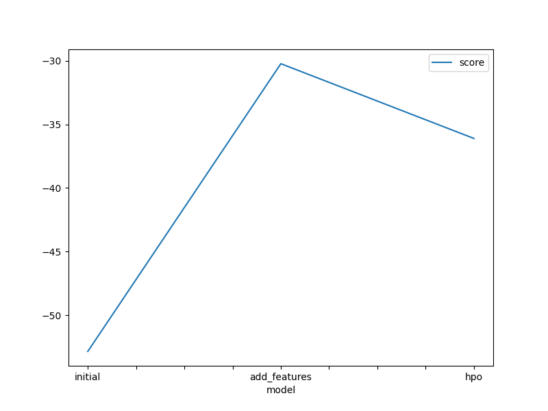
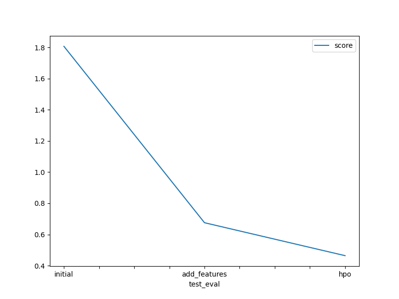

# Report: Predict Bike Sharing Demand with AutoGluon Solution
#### Ying Zhang

## Initial Training
### What did you realize when you tried to submit your predictions? What changes were needed to the output of the predictor to submit your results?
When I tried to submit my predictions, since there were negative values, Kaggle rejected my submission. I need to set negative values to zero in order to submit.

### What was the top ranked model that performed?
The top ranked model was the final model with new feature and hyperparameters tuned with autogluon since it has the lowest root mean squared error (RMSE) score comparing to initial training and training with one additional feature. In all training, the best model was WeightedEnsemble_L3.

## Exploratory data analysis and feature creation
### What did the exploratory analysis find and how did you add additional features?
Exploratory data analysis (EDA) finds that datetime is not used properly in the analysis, and seasons and weather are treated as integer, rather than category. After changing the data type of seasons and weather to category, and extrpolate hours in the datetime, I was able to acheive a lower RMSE. 

### How much better did your model preform after adding additional features and why do you think that is?
The RMSE score went down from 1.80694 in the initial training to 0.6755 with the additional features. This is about 62.2% better in model prediction. These are important modifications since at different time the demand for bike varies. Adding these indicators about time helped my model to predict better. 

## Hyper parameter tuning
### How much better did your model preform after trying different hyper parameters?
The RMSE score went down from 1.80694 in the initial training to 0.46422 with the additional features plus hyperparameter tuning. This is about four times better in model prediction. 

### If you were given more time with this dataset, where do you think you would spend more time?
I would spend more time in EDA and add additional relevat features. I have only added hours, and there are more features like month and day which could also be influential in predicting bike sharing peak time. Also, I will take more time in the fine-tuning and make sure to not overfitting the model.

### Create a table with the models you ran, the hyperparameters modified, and the kaggle score.
|model|hpo1|hpo2|hpo3|score|
|--|--|--|--|--|
|initial|default vals|default vals|default vals|1.80694|
|add_features|default vals|default vals|default vals|0.6755|
|hpo|NN epochs:[10], activation:['relu', 'softrelu', 'tanh'], learning rate: [1e-4, 1e-2], dropout_prob: [0.0, 0.5]|GBM num_boost_round: [100], num_leaves: [26, 66]|default vals|0.46422|

### Create a line plot showing the top model score for the three (or more) training runs during the project.

### Create a line plot showing the top kaggle score for the three (or more) prediction submissions during the project.

## Summary
My best model with the lowest RMSE score was the model that has hours added as a new feature, season and weather changed to category, and hyperparameters tuned. EDA helped me to find that the datetime is not taking into consideration so I added this as the feature. This is an important indicator to analyze bike sharing demand since demand may vary at different time of a day. Autogluon optimized my model and achieve the most representative result for the test data.
